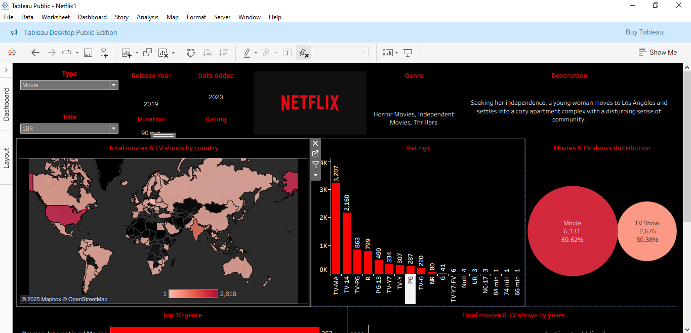
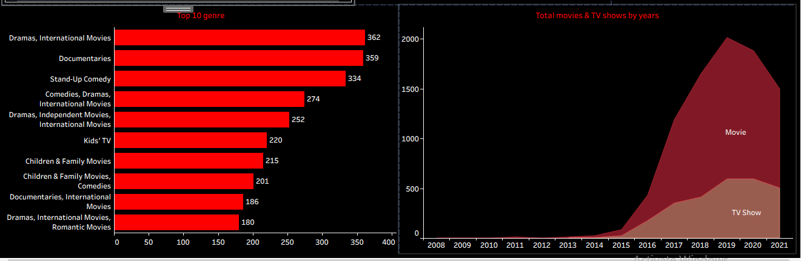

# 🎬 Netflix Titles Dashboard (Tableau)

---

## 📖 Overview
This project presents an **interactive Tableau dashboard** built using the **Netflix Titles dataset** from Kaggle.  
It explores key patterns in Netflix’s content library, helping visualize:
- The balance between Movies & TV Shows  
- Global distribution of content  
- Genre trends and audience ratings  
- Yearly addition of titles  

🔗 **Live Dashboard:** [View on Tableau Public](https://public.tableau.com/views/Netflix_17613964656980/Netflix?:language=en-GB&publish=yes&:sid=&:redirect=auth&:display_count=n&:origin=viz_share_link)] 

---

## 📊 Key Insights

| 🔍 Insight Area | 💡 Description |
|-----------------|----------------|
| 🎞️ **Content Type** | Movies dominate Netflix’s catalog compared to TV Shows |
| 🌎 **Country Analysis** | USA & India are among the top producers of Netflix titles |
| 📅 **Release Trend** | Major growth in content additions post-2015 |
| ⭐ **Ratings Distribution** | TV-MA and TV-14 are the most common ratings |
| 🎭 **Genres** | International Movies, Dramas, and Comedies lead in volume |

---

## 🧰 Tools & Technologies
| Tool | Purpose |
|------|----------|
| **Tableau Public** | Data visualization & dashboard creation |
| **Microsoft Excel / CSV** | Data cleaning and formatting |
| **GitHub** | Project hosting and documentation |
| **Kaggle Dataset** | Source of Netflix titles data |

---

## 📂 Dataset Information
**Dataset:** [`netflix_titles.csv`](https://www.kaggle.com/datasets/shivamb/netflix-shows)  
**Source:** Kaggle  
**Attributes:** Title, Director, Cast, Country, Release Year, Rating, Duration, Genre, etc.

---

## 🖼️ Dashboard Preview

*(Screenshot of the Tableau dashboard showing content type trends, genre breakdown, and release year distribution)*

---

## 🚀 Project Highlights
- Built a **clean, interactive dashboard** in Tableau Public.  
- Designed to highlight **patterns and trends** in Netflix’s catalog.  
- Used **data storytelling** to provide insights on content diversity and growth.

---

## 💡 Future Enhancements
- Integrate Netflix IMDb ratings for deeper analysis.  
- Add interactive filters by director or country.  
- Embed the dashboard in a web portfolio.

---

## 👩‍💻 Author
**Ankita Banubakode**  
📧 [banubakodeankita@gmail.com](mailto:banubakodeankita@gmail.com)  
💼 [LinkedIn Profile](www.linkedin.com/in/ankita-banu)  

---

⭐ *If you like this dashboard, please give this repo a star on GitHub!*  
